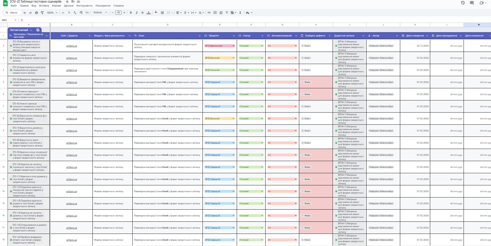
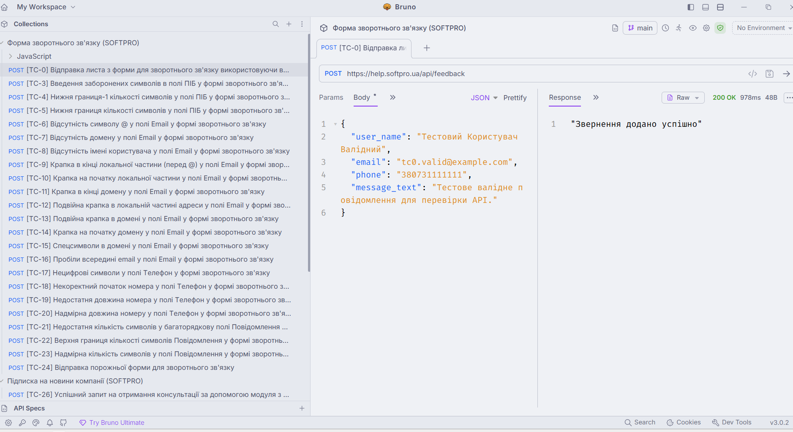
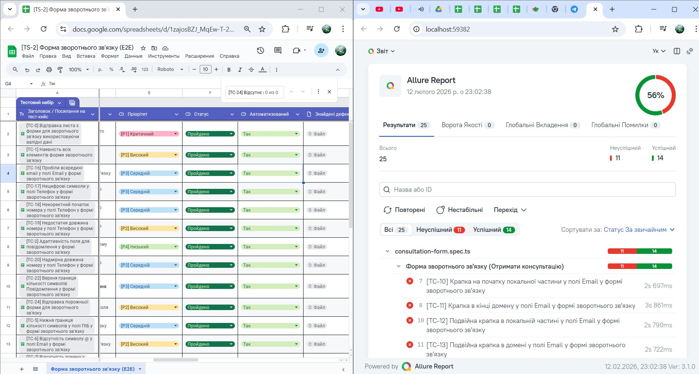

# 🚀 Тестування softpro.ua — Playwright + Bruno

Лаконічний набір UI та API тестів для двох сценаріїв:

- 🧾 Форма «Отримати консультацію»
- 📩 Підписка на новини компанії (Форма «Отримати консультацію» з одним полем)

## ✨ Що є в репозиторії

- **UI (Playwright)**
    - `consultation-form.spec.ts`
    - `newsletter-email.spec.ts`
- **Page Objects**
    - `pages/consultation-form.page.ts`
    - `pages/newsletter.page.ts`
- **API (Bruno `.bru`)**
    - `api/Форма зворотнього зв'язку (SOFTPRO)/...`
    - `api/Підписка на новини компанії (SOFTPRO)/...`
- **Документація кейсів**
    - `tests/consultation-form.md`
    - `tests/newsletter-email.md`

## 🖼️ Візуалізація

<p align="center">
    
    
    
</p>

## ⚡ Швидкий старт

Встановлення залежностей:

```bash
pnpm install
```

Запуск усіх UI тестів:

```bash
pnpm test
```

Запуск у `headed` режимі (Chromium):

```bash
pnpm run test:headed
```

Запуск конкретного spec-файлу:

```bash
npx playwright test newsletter-email.spec.ts --project=chromium -j 1 --headed
```

## 📊 Allure звіти

```bash
pnpm run allure:generate
pnpm run allure:open
```

## 🔒 Безпечний режим для production

За замовчуванням UI-тести перехоплюють `POST` на `/api/**`, щоб не створювати реальні дані.
Щоб дозволити реальні запити, увімкніть `RUN_PROD_REAL=true`.

Windows (cmd):

```bash
set RUN_PROD_REAL=true && npx playwright test
```

Unix/macOS:

```bash
RUN_PROD_REAL=true npx playwright test
```
